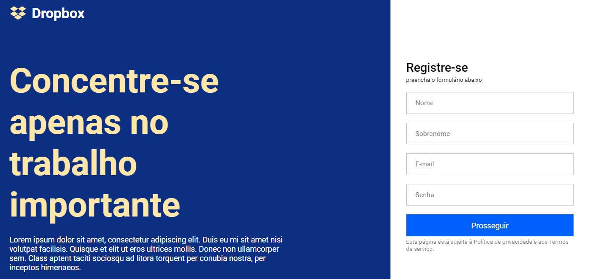

<h1 align="center">Clone Dropbox</h1>

<p align="center">
  <a href="#-descrição">Descrição</a>&nbsp;&nbsp;&nbsp;|&nbsp;&nbsp;&nbsp;
  <a href="#-demonstração">Demonstração</a>&nbsp;&nbsp;&nbsp;|&nbsp;&nbsp;&nbsp;
  <a href="#-tecnologias">Tecnologias</a>&nbsp;&nbsp;&nbsp;|&nbsp;&nbsp;&nbsp;
  <a href="#-como-executar-frontend">Como executar Frontend</a>&nbsp;&nbsp;&nbsp;|&nbsp;&nbsp;&nbsp;
  <a href="#-licença">Licença</a>
</p>

## Descrição

- Projeto clone do site dropbox.

## Demonstração



## ✨ Tecnologias

Esse projeto foi desenvolvido com as seguintes tecnologias:

- [TypeScript](https://www.typescriptlang.org/)
- [Reactjs](https://pt-br.reactjs.org/)

## 🎲 Como executar Frontend

```bash
# Clone este repositório
$ git clone https://github.com/Bruno-Cesar123/clone_dropbox.git

# Acesse a pasta do projeto no terminal/cmd
$ cd clone-dropbox

# Instale as dependências
$ npm install ou yarn

# Execute a aplicação em modo de desenvolvimento
$ $ npm run start ou yarn start

# O servidor inciará na porta:3000 - acesse <http://localhost:3000>
```


Esse projeto está sob a licença MIT. Veja o arquivo [LICENSE](license) para mais detalhes.

---

Feito por **Bruno Cesar** [**LinkedIn**](https://www.linkedin.com/in/bruno-cesar-b0039715a/)